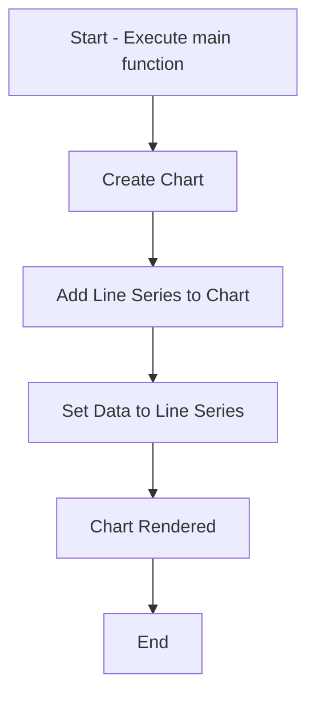

You can provide this prompt to the LLM, and it will generate:

- A **step-by-step implementation guide** explaining the functionality of the code at a high level.
- A **Mermaid diagram** visually depicting the logical flow and data transitions in the program.

This generic system prompt ensures adaptability and usability across different domains and codebases.


```html
<!DOCTYPE html>
<html lang="en">
<head>
    <meta charset="UTF-8">
    <meta name="viewport" content="width=device-width, initial-scale=1.0">
    <script src="https://unpkg.com/lightweight-charts@3.5.0/dist/lightweight-charts.standalone.production.js"></script>
    <title>Candlestick Chart</title>
</head>
<body>
<script>

const data = [
    { time: '2019-04-11', value: 80.01 },
    { time: '2019-04-12', value: 96.63 },
    { time: '2019-04-13', value: 76.64 },
    { time: '2019-04-14', value: 81.89 },
    { time: '2019-04-15', value: 74.43 },
    { time: '2019-04-16', value: 80.01 },
    { time: '2019-04-17', value: 96.63 },
    { time: '2019-04-18', value: 76.64 },
    { time: '2019-04-19', value: 81.89 },
    { time: '2019-04-20', value: 74.43 },
]


// Main function to orchestrate chart initialization and updates
function main() {
  
    const chart = LightweightCharts.createChart(document.body, { width: 400, height: 300 });
    const lineSeries = chart.addLineSeries();
    lineSeries.setData(data);

}
// Execute main function
main();


</script>
</body>
</html>
```




This diagram represents:
1. **A (Start)**: Main function execution begins.
2. **B (Create Chart)**: A chart object is created using `LightweightCharts.createChart`.
3. **C (Add Line Series)**: A line series is added to the chart using `chart.addLineSeries`.
4. **D (Set Data)**: Data is passed to the line series using `lineSeries.setData(data)`.
5. **E (Chart Rendered)**: The chart is displayed with the provided data.
6. **F (End)**: Execution completes.

Let me know if you'd like further modifications or help!


---

# Implementation Documentation

This guide outlines the step-by-step process to create a basic candlestick chart from scratch using the flow described in the Mermaid diagram.

---

## **1. Start - Execute Main Function**

The main function serves as the entry point of the application. Its primary purpose is to orchestrate all the steps required to create and render the chart. Ensure this function is invoked to kickstart the process.

---

## **2. Create Chart**

Use the `LightweightCharts.createChart()` method to create a chart object. This function initializes a chart instance within the desired HTML container (e.g., the `document.body` or a specific `<div>` element).

- **Inputs**: Provide dimensions for the chart as an object, such as `{ width: 400, height: 300 }`.
- **Outputs**: Returns a chart object that can be used to add data series and modify chart settings.

---

## **3. Add Line Series to Chart**

Using the chart object created in the previous step, add a line series to the chart by invoking the `chart.addLineSeries()` method.

- **Purpose**: A line series represents the type of data visualization (e.g., a line graph).
- **Outputs**: Returns a line series instance that can be used to populate the chart with data.

---

## **4. Set Data to Line Series**

Pass the data to the line series instance using the `lineSeries.setData()` method.

- **Data Schema**: The data must be an array of objects where each object adheres to the schema:
    
    
    `{ "time": "ISO 8601 format", "value": number }`
    
    - **time**: A string representing the timestamp in ISO 8601 format.
    - **value**: A numeric value corresponding to the data point.
- **Behavior**: The method populates the chart with the provided data points, rendering them according to the defined series.

---

## **5. Chart Rendering**

Call the `main` function to execute the above steps. The chart will be displayed in the HTML container with the provided dimensions and data.

- **Note**: Ensure the script and HTML file include the necessary library for `LightweightCharts`.

---

## **6. End**

At this stage, the chart is rendered, and the process is complete.

---

This high-level documentation should allow anyone to implement a similar charting solution without referring to the original code. Let me know if you need additional details or refinements!